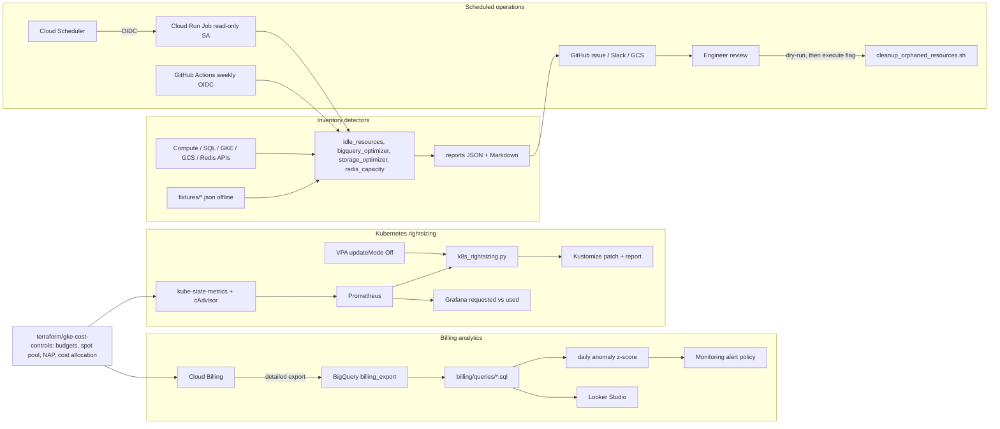

# cloud-cost-optimization

FinOps toolkit for GCP and Kubernetes: idle resource detection, billing analysis in BigQuery, workload rightsizing from Prometheus data, storage and BigQuery optimization, Redis capacity planning, cost dashboards, and safe cleanup automation.


## Project Overview

This repository is a working FinOps toolkit for a platform team running GCP and GKE. It combines SQL against the Cloud Billing export, Python detectors that inventory idle resources and derive rightsizing recommendations from Prometheus and `INFORMATION_SCHEMA` data, Terraform for cluster-level cost controls and budgets, dashboards for engineers and finance, and cleanup automation whose default mode is dry-run. Every detector runs fully offline against synthetic fixtures, which is how the committed sample reports were produced.

> **Scope note:** This is a personal reference implementation built to demonstrate production-grade patterns I use professionally. It is not the production code of any employer, and all project IDs, domains, IPs, and data are placeholders or synthetic.

All cost figures in reports and docs are example calculations using placeholder unit prices (`detectors/pricing.example.json`) on synthetic data. Nothing here claims realised savings.

## Problem Statement

Cloud spend grows in ways no single team sees: disks outlive the VMs they were attached to, Kubernetes requests are set once at launch and never revisited, BigQuery tables are scanned unpartitioned by dashboards every 15 minutes, buckets keep every version forever, and a Redis instance with `noeviction` runs out of memory at 03:00. Commercial FinOps platforms attribute cost but rarely tell an engineer exactly which patch to apply. The gap this repo fills:

- Attribution and anomaly detection from the billing export, with GKE namespace-level showback.
- Detectors that turn metrics into concrete, reviewable recommendations (JSON + Markdown + Kustomize patches).
- Guardrails (budgets, quotas, autoscaling profiles, spot pools) that prevent the recurring classes of waste.
- Automation that reports every week and deletes nothing without a human and a second identity.

## Architecture

Four pipelines share one findings model and one report format. The **billing pipeline** exports detailed usage to BigQuery where the queries in `billing/queries/` produce service, label and namespace breakdowns, CUD coverage, egress analysis and a z-score anomaly feed. The **rightsizing pipeline** reads 14 days of container CPU and memory percentiles from Prometheus (or a VPA export) and emits requests/limits with headroom plus a strategic-merge patch. The **inventory detectors** call Compute, Cloud SQL, GKE, GCS and Memorystore APIs (or fixtures) to find orphaned and idle resources, BigQuery layout problems, lifecycle opportunities and Redis capacity risks. The **operations pipeline** runs the detectors weekly from Cloud Scheduler through a read-only Cloud Run Job and from GitHub Actions via OIDC, publishes reports to GCS, Slack and a GitHub issue, and gates destructive cleanup behind dry-run output and a separate identity. Details in `docs/architecture.md`.

## Architecture Diagram



## Technology Stack

| Layer | Technology | Purpose |
| --- | --- | --- |
| Billing data | Cloud Billing detailed export, BigQuery, GKE cost allocation | Source of truth, showback, anomaly detection |
| Detectors | Python 3.11+, standard library (google-cloud-* only in live mode) | Idle resources, rightsizing, BigQuery, GCS, Redis analysis |
| Metrics | Prometheus / Managed Prometheus, kube-state-metrics, cAdvisor, VPA | Usage percentiles and reliability signals |
| Infrastructure | Terraform >= 1.6, hashicorp/google ~> 6.0 | GKE autoscaling profile, NAP, spot pool, budgets, alert policy |
| Kubernetes | VPA, ResourceQuota, LimitRange, kube-downscaler | Recommendation mode, namespace caps, nonprod schedules |
| Automation | Cloud Scheduler, Cloud Run Jobs, GitHub Actions (OIDC), bash + gcloud | Weekly reports, dry-run-first cleanup |
| Dashboards | Grafana, Cloud Monitoring, Looker Studio | Engineer, on-call and finance views |
| Quality | unittest, ruff, sqlfluff, terraform validate, Trivy | CI gates |

## Repository Structure

```text
cloud-cost-optimization/
├── billing/
│   ├── bigquery-export-setup.md
│   ├── schema-notes.md
│   └── queries/
│       ├── cost-by-service-30d.sql
│       ├── cost-by-project-label-env.sql
│       ├── gke-cost-by-namespace.sql
│       ├── committed-use-coverage.sql
│       ├── unattached-disks-cost.sql
│       ├── egress-cost.sql
│       ├── daily-anomaly-detection.sql
│       └── credits-and-discounts.sql
├── detectors/
│   ├── common.py                 # findings model, stats, Markdown helpers
│   ├── idle_resources.py
│   ├── k8s_rightsizing.py
│   ├── bigquery_optimizer.py
│   ├── storage_optimizer.py
│   ├── redis_capacity.py
│   ├── pricing.example.json      # placeholder unit prices
│   ├── fixtures/                 # synthetic inputs (offline mode)
│   └── tests/                    # unittest, one module per detector
├── kubernetes/
│   ├── vpa-recommendation-only.yaml
│   ├── resource-quotas.yaml
│   ├── kube-downscaler-values.yaml
│   └── cluster-autoscaler-notes.md
├── terraform/gke-cost-controls/  # cluster, spot pool, NAP, budget, alert policy
├── cleanup/
│   ├── cleanup_orphaned_resources.sh
│   ├── gke-scale-down-nonprod.sh
│   ├── pools.example.conf
│   └── scheduled-cleanup-cloud-run-job/
│       ├── Dockerfile
│       ├── main.py
│       ├── job.yaml
│       ├── scheduler.yaml
│       └── iam.md
├── dashboards/
│   ├── grafana-cost-dashboard.json
│   ├── cloud-monitoring-dashboard.json
│   └── looker-studio-setup.md
├── reports/
│   ├── sample-report.md          # generated from fixtures by `make report`
│   └── rightsizing-sample.md
├── docs/
│   ├── architecture.md
│   ├── finops-methodology.md
│   ├── rightsizing-methodology.md
│   ├── bigquery-optimization.md
│   ├── storage-optimization.md
│   ├── redis-capacity-planning.md
│   ├── cud-and-sud.md
│   └── guardrails.md
├── .github/workflows/
│   ├── ci.yml
│   └── scheduled-report.yml
├── Makefile
├── requirements.txt
├── .env.example
├── .gitignore
└── LICENSE
```

## Prerequisites

- Python 3.11 or newer (detectors need only the standard library in offline mode; tests use PyYAML).
- `gcloud` CLI authenticated to a project for live mode and cleanup scripts.
- Terraform >= 1.6 for `terraform/gke-cost-controls`.
- For live detectors: `pip install -r requirements.txt`, Application Default Credentials, and the roles listed in `cleanup/scheduled-cleanup-cloud-run-job/iam.md`.
- Cloud Billing detailed export enabled (`billing/bigquery-export-setup.md`); GKE cost allocation enabled on clusters.
- Prometheus with kube-state-metrics and cAdvisor metrics reachable from where `k8s_rightsizing.py` runs.

## Installation

```bash
git clone https://github.com/deveshr17/cloud-cost-optimization.git
cd cloud-cost-optimization

python3 -m venv .venv && source .venv/bin/activate
pip install pyyaml                     # enough for tests and offline mode
# pip install -r requirements.txt      # add Google clients for live mode

make test                              # 46 unit tests
make report                            # regenerate reports/ from fixtures
make lint                              # bash -n, compileall, YAML/JSON parse, optional ruff/sqlfluff
make tf-validate                       # terraform fmt + init -backend=false + validate
```

## Configuration

Copy `.env.example` to `.env` and set the placeholders; the Makefile and scripts read `GOOGLE_CLOUD_PROJECT`, `PROMETHEUS_URL`, `CLEANUP_*` from the environment.

| Item | Where | Notes |
| --- | --- | --- |
| Unit prices | `detectors/pricing.example.json` or `--pricing path` | Replace with Cloud Billing Catalog API output for your region and contract |
| Rightsizing headroom and limits policy | `k8s_rightsizing.py --cpu-headroom 0.30 --mem-headroom 0.20 --cpu-limits none|2x` | See `docs/rightsizing-methodology.md` |
| Idle thresholds | `idle_resources.py --min-snapshot-age-days 90 --min-stopped-days 14 --max-sql-connections 1` | |
| Cleanup thresholds and exclusions | `cleanup_orphaned_resources.sh --min-age-days 30 --exclude-label keep=true` | Dry-run unless `--execute` |
| Nonprod pools | `cleanup/pools.example.conf` | Refuses names containing `prod` |
| Terraform inputs | `terraform/gke-cost-controls/terraform.tfvars.example` | Budget amount, thresholds, spot pool size, NAP ceilings |
| Billing table names | `billing/queries/*.sql` placeholders `example-project-billing.billing_export.gcp_billing_export_resource_v1_…` | Replace with your export table |

Every detector accepts `--from-json <fixture>` for offline runs and `--json-out` / `--md-out` for outputs.

## Deployment

1. **Billing export**: follow `billing/bigquery-export-setup.md`; create the `v_cost_daily` view; schedule `daily-anomaly-detection.sql` as a BigQuery scheduled query writing to `finops.anomalies`.
2. **Cluster cost controls**: `cd terraform/gke-cost-controls && cp terraform.tfvars.example terraform.tfvars && terraform init && terraform apply`. This enables cost allocation, `OPTIMIZE_UTILIZATION`, NAP limits, the spot pool, the budget and the anomaly alert policy.
3. **Kubernetes objects**: `kubectl apply -f kubernetes/vpa-recommendation-only.yaml -f kubernetes/resource-quotas.yaml`; install kube-downscaler with `kubernetes/kube-downscaler-values.yaml` on nonprod clusters.
4. **Scheduled job**: build the image with `cleanup/scheduled-cleanup-cloud-run-job/Dockerfile` (context = repo root), push to Artifact Registry with a SHA tag, `gcloud run jobs replace job.yaml`, create the Scheduler job from `scheduler.yaml`, and grant the roles in `iam.md`.
5. **Dashboards**: import `dashboards/grafana-cost-dashboard.json` (select the Prometheus datasource), `gcloud monitoring dashboards create --config-from-file dashboards/cloud-monitoring-dashboard.json`, and build the Looker Studio report per `dashboards/looker-studio-setup.md`.
6. **Cleanup**: run `cleanup/cleanup_orphaned_resources.sh --project <id>` (dry-run), review the log, then re-run with `--execute` under an identity with delete rights.

## CI/CD

`ci.yml` runs on every push and pull request with `contents: read`:

- **python**: ruff, 46 unit tests, `make report`, and a diff check that fails if `reports/` no longer matches the fixtures; runs the Cloud Run job entrypoint in fixture mode; uploads detector output.
- **static**: `bash -n` on every script, YAML/JSON parse, `sqlfluff` with the BigQuery dialect (advisory).
- **terraform**: `fmt -check`, `init -backend=false`, `validate`.
- **container**: builds the detector image (not pushed), Trivy scan at `0.28.0` failing on unfixed CRITICAL/HIGH, SARIF uploaded to code scanning.

`scheduled-report.yml` runs Monday 07:00 IST (and on demand with a fixture toggle). It authenticates with `google-github-actions/auth@v2` using Workload Identity Federation (`workload_identity_provider` + `service_account` from secrets; no JSON keys), runs the detectors, and uses `actions/github-script@v7` to close last week's `finops-report` issue and open a new one with the collapsed reports. Actions are pinned to major versions; jobs have `timeout-minutes` and concurrency groups.

## Security

- No credentials in the repo; `.gitignore` covers `.env`, `*.tfvars`, state, keys and kubeconfigs. `.env.example` and `terraform.tfvars.example` hold placeholders only.
- GitHub Actions uses OIDC/WIF; minimal `permissions` per job (`id-token: write` and `issues: write` only where used).
- The Cloud Run Job runs as a dedicated read-only service account; Cloud Scheduler uses a second account with `run.invoker` on one job. Deletion rights are never granted to automation.
- Cleanup defaults to dry-run, honours `keep=true`, snapshots disks before deletion, refuses `prod`-named targets in the downscaler, and logs every decision.
- Container runs as UID 10001, no shell for the user, dependencies pinned by range and scanned with Trivy.
- Slack webhook is read from Secret Manager via `secretKeyRef`; never inlined.
- Terraform uses `google_project_iam_member` (never project-level `*_iam_policy`), no `roles/owner` or `roles/editor`, Shielded nodes, Workload Identity, and `deletion_protection` in prod.
- Billing data access is via authorised views and groups; see `docs/guardrails.md`.

## Monitoring

| Signal | Where | Threshold or use |
| --- | --- | --- |
| Daily net cost by project/service | `daily-anomaly-detection.sql`, alert policy in Terraform | z >= 3 and delta >= 50 currency units |
| Budget actual and forecast | `google_billing_budget` -> Pub/Sub + email | 50/80/90/100% actual, 100/120% forecast |
| Requested vs used CPU/memory by namespace | Grafana `finops-k8s-waste` | Utilisation < 40% for a week = rightsizing candidate |
| CPU throttling and OOMKilled | Grafana reliability row | Vetoes downward changes |
| PDBs blocking scale-down | Grafana panel 17 | Any non-zero count investigated |
| Cloud SQL connections, Memorystore usage ratio, BigQuery scanned bytes, GCS bytes by class | Cloud Monitoring dashboard | Idle instance, capacity deadline, scan spikes, lifecycle effect |
| Weekly report | GitHub issue `finops-report`, GCS bucket, Slack | Human review cadence |

## Troubleshooting

| Symptom | Likely cause | How to check | Fix |
| --- | --- | --- | --- |
| Detector exits with "Live mode needs --project" | No project and no fixture given | Re-run with `-v` | Pass `--project` or `--from-json` |
| `google.cloud.* is required for live mode` | Runtime deps not installed | `pip list \| grep google-cloud` | `pip install -r requirements.txt` |
| `k8s_rightsizing.py` returns no containers | Prometheus missing kube-state-metrics or cAdvisor series | Query `kube_pod_container_resource_requests` in Prometheus UI | Install kube-state-metrics; check `container!=""` label presence |
| Rightsizing patch applied but nodes did not shrink | Scale-down blocked | `kubectl get events -A --field-selector reason=ScaleDown` | Fix PDBs, `safe-to-evict` annotations; see `kubernetes/cluster-autoscaler-notes.md` |
| HPA scaled out after lowering requests | HPA target is utilisation of requests | `kubectl describe hpa` | Retune target or move to an absolute metric |
| `gke-cost-by-namespace.sql` shows everything as `(unallocated)` | Cost allocation not enabled | `gcloud container clusters describe ... --format='value(costManagementConfig.enabled)'` | `--enable-cost-allocation`; data appears within a day |
| Anomaly query alerts on every service on the 1st | Baseline includes month-boundary restatements | Look at `export_time` vs `usage_start_time` | Increase `settle_days`; filter `cost_type = 'regular'` |
| `cleanup_orphaned_resources.sh` deletes nothing | Dry-run default | Log line `[DRY-RUN]` | Add `--execute` (and confirm identity has delete rights) |
| Cleanup skipped a resource you expected | `keep=true` label present | Log line `SKIP ... labelled keep=true` | Remove the label with the owner's approval |
| `terraform validate` fails on `google_billing_budget` | Missing google-beta provider or wrong billing ID format | Error message | Provider block present in `providers.tf`; ID must match `XXXXXX-XXXXXX-XXXXXX` |
| CI fails on "reports/ is out of date" | Fixture or detector changed without regenerating | `make report && git diff reports/` | Commit the regenerated reports |
| Scheduled workflow fails at auth | WIF provider/SA secrets missing or pool condition mismatch | Workflow logs from `google-github-actions/auth` | Set `GCP_WORKLOAD_IDENTITY_PROVIDER` and `GCP_FINOPS_SERVICE_ACCOUNT`; check attribute condition on the pool |
| Redis report shows cost increase | Instance is genuinely undersized for growth | `days_to_maxmemory` in the report | Fix TTLs and big keys first, then resize |

## Cost Considerations

- The toolkit's own footprint is small: a Cloud Run Job running a few minutes a week, a Scheduler job, the billing dataset (a few GB per month), and optionally a 1 GB BI Engine reservation.
- Billing export queries are partitioned by `_PARTITIONTIME` and scoped to 30-90 days; a full-history query on a large account can scan tens of GB, so keep dashboard views bounded.
- Live detector runs make list calls only; no cost beyond API quota.
- The Grafana cost panels multiply requests by placeholder unit prices set as dashboard variables; they are estimates for prioritisation, not invoices.
- Spot pools, `OPTIMIZE_UTILIZATION` and nonprod schedules trade availability for cost; the docs describe the preconditions (PDBs, probes, idempotent batch) rather than promising a number.
- Committing to CUDs before rightsizing locks in waste; `docs/cud-and-sud.md` describes ordering and trough-based sizing.

## Future Improvements

- Complete live collectors for GKE node pools, forwarding rules and Cloud SQL connection metrics (currently documented extension points; disks, addresses and snapshots are implemented).
- Pull unit prices from the Cloud Billing Catalog API at runtime instead of `pricing.example.json`.
- Add AWS CUR and Azure cost export loaders so the same anomaly and showback queries run across clouds.
- Kubernetes admission policy (Kyverno) that enforces the tagging standard and LimitRange defaults, referenced from `docs/guardrails.md`.
- Emit findings as OpenMetrics so Grafana can trend the idle-resource run-rate over time rather than reading a weekly issue.
- Rightsizing for GKE Autopilot and Cloud Run (requests are the bill there), and for Cloud SQL tiers from CPU/memory utilisation.
- Pub/Sub consumer that turns budget notifications into Slack threads with the matching anomaly rows attached.
